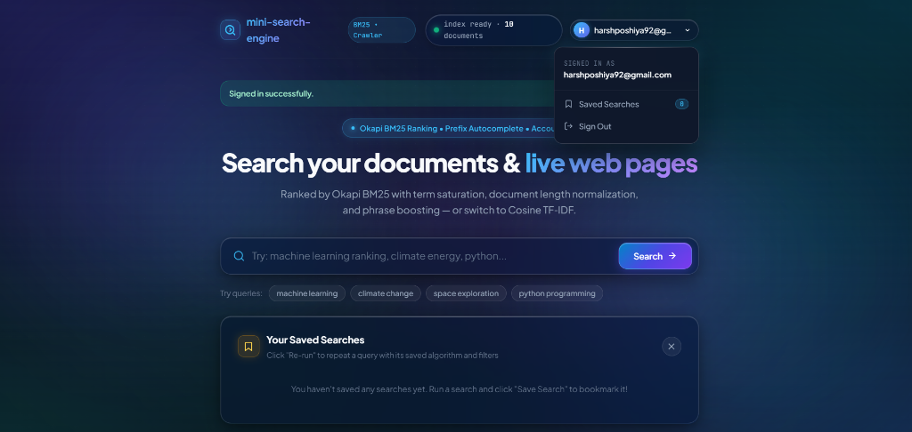
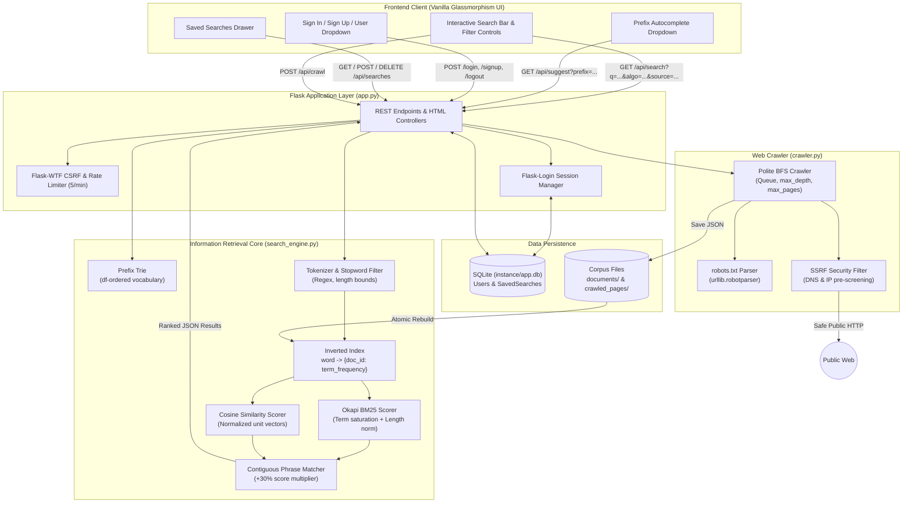

# Mini Search Engine

A lightweight, from-scratch search engine and web crawler built in Python and Flask—implementing Okapi BM25 and vector-space Cosine TF-IDF ranking, an inverted index, real-time Prefix Trie autocomplete, SSRF-hardened web crawling, user accounts, and saved searches, all wrapped in a glassmorphism interface.

[](https://github.com/poshiyaharsh/Mini-Search-Engine/actions/workflows/tests.yml)
[](https://www.python.org/)
[](https://flask.palletsprojects.com/)
[](LICENSE)
[](tests/)

---

## Visual Demo


> *Tip: Replace `docs/demo.png` with a screen recording GIF showing a live query typed into the search bar, instant Prefix Trie suggestions, BM25 ranked result cards, and the collapsible "Saved Searches" drawer.*

---

## Features

- **From-Scratch Information Retrieval (No Lucene/Elasticsearch):** Every algorithm, data structure, and mathematical formula is implemented directly in plain Python.
- **Okapi BM25 Ranking (Default):** Industry-standard IR ranking incorporating asymptotic term saturation ($k_1 = 1.5$), document length normalization ($b = 0.75$), and Robertson-Spärck Jones IDF.
- **Phrase-Match Boosting:** Multi-word queries appearing as exact contiguous sequences receive an automatic **$+30\%$ ($1.3\times$) score boost**.
- **Comparative Cosine TF-IDF:** Switch algorithms on the fly to inspect and compare vector space angular similarities with sublinear TF scaling.
- **Prefix Trie Autocomplete:** Instant, real-time query suggestions ranked descending by corpus document frequency (`df`), debounced at 250ms with full keyboard arrow navigation.
- **Multi-Dimensional Filtering:** Dynamically isolate results by source (`All`, `Local Docs`, `Crawled Web`) and set minimum score cutoffs (`> 0.05` to `> 0.50`).
- **Polite & SSRF-Hardened Web Crawler:** Breadth-first crawler respecting `robots.txt`, enforcing a 1-second domain delay, and blocking loopback, RFC 1918 private subnets, and cloud metadata IPs (`169.254.169.254`).
- **User Accounts & Saved Searches:** Session authentication via Flask-Login, `scrypt` password hashing, Flask-WTF CSRF protection, and strictly isolated, one-click saved search bookmarking backed by SQLite.
- **Automated Test Suite (88% Coverage):** 57 automated unit and integration tests using `pytest`, `pytest-cov`, and `responses` for mocked HTTP, running via GitHub Actions CI.

---

## Architecture & System Design



### Query Execution Lifecycle
1. **Input Preprocessing:** The query string is tokenized, stripped of punctuation, converted to lowercase, and filtered for English stopwords.
2. **Inverted Index Lookup:** The engine matches query terms against posting lists `word -> {doc_id: tf}` in $O(1)$ time per term.
3. **Scoring:**
   - **BM25:** Calculates term weights factoring in Robertson-Spärck Jones IDF, asymptotic saturation ($k_1=1.5$), and document length relative to average length (`avgdl`).
   - **Cosine:** Calculates dot products over pre-normalized document vectors using sublinear term frequency.
4. **Phrase Boosting:** Evaluates regex pattern matching for contiguous phrase sequences in raw document text, applying a $+30\%$ boost.
5. **Filtering & Sorting:** Applies active source and score cutoff filters, sorting candidate matches in descending order.

---

## How the Ranking Math Works

### 1. Okapi BM25
Okapi BM25 overcomes the weaknesses of classic TF-IDF:

$$\text{score}(D, Q) = \sum_{t \in Q} \text{IDF}_{\text{BM25}}(t) \cdot \frac{tf(t, D) \cdot (k_1 + 1)}{tf(t, D) + k_1 \cdot \left(1 - b + b \cdot \frac{|D|}{\text{avgdl}}\right)}$$

- **Term Saturation ($k_1 = 1.5$):** Diminishing returns on repeated terms. Even if a keyword appears 100 times, its score contribution asymptotically approaches an upper limit, preventing keyword stuffing.
- **Document Length Normalization ($b = 0.75$):** Normalizes the document length $|D|$ against the average document length $\text{avgdl}$ of the entire corpus. Short documents with relevant matches are rewarded, while verbose documents containing incidental terms are dampened.
- **Smooth RSJ IDF:** Guaranteed positive discrimination across all terms:
  $$\text{IDF}_{\text{BM25}}(t) = \ln\left(\frac{N - \text{df}(t) + 0.5}{\text{df}(t) + 0.5} + 1.0\right)$$

### 2. Vector Space Cosine Similarity
Calculates the cosine of the angle between high-dimensional query and document vectors:

$$\text{similarity}(\vec{q}, \vec{d}) = \frac{\vec{q} \cdot \vec{d}}{\|\vec{q}\| \|\vec{d}\|}$$

- Uses sublinear term frequency ($1 + \ln(tf)$) and smoothed inverse document frequency.
- Output is normalized strictly between $0.0$ and $1.0$.

### Benchmark Comparison

| Query | Document | Algorithm | Score | Phrase Match? | Behavioral Characteristics |
| :--- | :--- | :--- | :--- | :--- | :--- |
| **`machine learning`** | *Machine Learning* | **BM25** | **5.2708** | Yes (+30%) | High saturation reward + phrase bonus |
| | *Machine Learning* | **Cosine** | **0.3688** | Yes (+30%) | Normalized angular similarity |
| | *Ai Basics* | **BM25** | **3.4231** | Yes (+30%) | Length normalization prevents verbosity bias |
| **`climate change`** | *Climate Change* | **BM25** | **7.9665** | Yes (+30%) | Dedicated topic rewarded strongly |
| | *Financial Markets* | **BM25** | **1.4867** | No | Incidental mention dampened by BM25 |

---

## Quick Start & Setup

### 1. Prerequisites
- Python 3.11 or 3.12
- Git

### 2. Installation
```bash
# Clone repository
git clone https://github.com/poshiyaharsh/Mini-Search-Engine.git
cd Mini-Search-Engine

# Create and activate virtual environment
python -m venv venv
# Windows:
venv\Scripts\activate
# Linux/macOS:
source venv/bin/activate

# Install runtime dependencies
pip install -r requirements.txt
```

### 3. Run the Web Application
```bash
python app.py
```
Open **`http://127.0.0.1:5000`** in your browser.  
*(The SQLite database at `instance/app.db` and corpus directories are initialized automatically on startup).*

### 4. Run Automated Tests & Code Coverage
```bash
# Install development and test dependencies
pip install -r requirements-dev.txt

# Run all 58 automated tests
pytest -v

# Run tests with code coverage breakdown
pytest --cov=. --cov-report=term-missing
```

---

## Deploy to Production (Render)

This repository is pre-configured for instant zero-downtime deployment on **[Render](https://render.com)** (as well as Railway, Fly.io, or Heroku via WSGI standard `Procfile`).

### Option A: 1-Click Render Blueprint (Recommended)
1. Push or fork this repository to your GitHub account.
2. Sign in to your [Render Dashboard](https://dashboard.render.com).
3. Click **New +** > **Blueprint**.
4. Connect your `Mini-Search-Engine` GitHub repository.
5. Render detects [`render.yaml`](render.yaml), configures the Python 3.12 environment, installs dependencies, sets up the Gunicorn WSGI start command, wires the `/healthz` health check, and generates a cryptographically secure `SECRET_KEY`.
6. Click **Apply** — your search engine will be live at an HTTPS URL (e.g. `https://mini-search-engine-xxxx.onrender.com`).

### Option B: Manual Web Service Setup
1. On the [Render Dashboard](https://dashboard.render.com), click **New +** > **Web Service**.
2. Connect your GitHub repository.
3. Configure the following service settings:
   - **Runtime:** `Python`
   - **Branch:** `main`
   - **Build Command:** `pip install -r requirements.txt`
   - **Start Command:** `gunicorn --workers 2 --threads 4 --timeout 120 --access-logfile - --error-logfile - app:app`
   - **Health Check Path:** `/healthz`
4. Under **Environment Variables**, configure:
   | Variable | Recommended Value | Purpose |
   | :--- | :--- | :--- |
   | `FLASK_ENV` | `production` | Enables secure session cookies and production defaults |
   | `FLASK_DEBUG` | `0` | Disables Flask debug mode and suppresses error traces |
   | `PYTHON_VERSION` | `3.12.10` | Specifies Python 3.12 build image |
   | `SECRET_KEY` | *(Click "Generate" or random 32-byte hex)* | Encrypts session cookies & CSRF tokens |
5. Click **Create Web Service**.

### Persistent Storage & Production Database Notes
- **Default (SQLite):** Out of the box, user accounts and search history are stored in SQLite (`instance/app.db`), and corpus documents are indexed on startup. On Render's free tier, the container filesystem is ephemeral (resets on sleep/restart).
- **Persistent Disk (Optional):** To retain newly crawled web pages and SQLite accounts across container restarts on Render, attach a Persistent Disk mounted at `/var/data` and set `DATA_DIR=/var/data`.
- **Managed PostgreSQL (Optional):** For enterprise user persistence, create a Render PostgreSQL database, copy its **Internal Database URL**, and set `DATABASE_URL` in your web service. The app automatically converts legacy `postgres://` to `postgresql://` and boots tables on startup.

### Verifying the Live Deployment
Once deployed, verify your live search engine:
1. Visit `https://<your-service>.onrender.com/healthz` — returns HTTP 200:
   ```json
   {"status": "healthy", "documents_indexed": 12, "environment": "production"}
   ```
2. Search a query (e.g. `"search engine inverted index"` with BM25).
3. Register a user account, bookmark queries, and verify instant suggestions.

---

## Design Decisions & Trade-Offs

### 1. Why BM25/Cosine instead of SQL `LIKE '%query%'`?
- **Relevance Ranking:** SQL `LIKE` performs a binary pattern match (a document matches or it doesn't). It has zero mathematical concept of term rarity (IDF), term frequency (TF), or document length normalization.
- **Search Complexity:** SQL `LIKE` requires an $O(N)$ full table scan because leading wildcards invalidate B-tree indexes. An inverted index enables $O(1)$ dictionary term lookup and $O(\text{postings})$ candidate retrieval.

### 2. Why SQLite instead of PostgreSQL for this project?
- **Portability & Simplicity:** SQLite requires zero background services, no Docker containers, and stores state in a single file (`instance/app.db`). This makes the application entirely self-contained for local evaluation and continuous integration testing.
- **Performance Profile:** For local personal search engines handling session management and tens of bookmarked queries per user, SQLite's in-process write-ahead logging (WAL) delivers microsecond read latencies without network overhead. Migrating to PostgreSQL requires updating only the `SQLALCHEMY_DATABASE_URI` configuration.

### 3. How to Scale to Millions of Documents?
If scaling this system to web-scale volumes, the following architectural upgrades would be required:
1. **Disk-Backed Segmented Postings:** Replace in-memory Python dictionaries with immutable on-disk inverted index segments (SSTables with finite-state transducers for term dictionaries), periodically merging segments in the background (similar to Apache Lucene / Elasticsearch).
2. **Distributed Index Sharding:** Partition documents across multiple worker nodes using document-ID hashing. A coordinator node scatters search queries to all shards in parallel and performs a $k$-way merge of the top scoring results.
3. **Query Result & Term Caching:** Implement a distributed cache (e.g. Redis) to cache frequent query responses and hot term posting lists, bypassing disk I/O for repetitive traffic.
4. **Asynchronous Distributed Crawler:** Separate crawling from the web process using an asynchronous task queue (e.g. Celery + Redis/RabbitMQ) with centralized domain-level rate limiting.

---

## Repository Structure

```
mini-search-engine/
├── app.py                      # Flask REST APIs, authentication controllers, error handling, health check
├── search_engine.py            # Core IR: Tokenizer, PrefixTrie, inverted index, BM25 & Cosine
├── crawler.py                  # Polite BFS web crawler: robots.txt compliance, SSRF defense
├── models.py                   # SQLAlchemy database models: User and SavedSearch
├── forms.py                    # Flask-WTF validation forms (CSRF, email, password length)
├── requirements.txt            # Production runtime dependencies (Flask, Gunicorn, etc.)
├── requirements-dev.txt        # Testing dependencies (pytest, pytest-cov, responses)
├── Procfile                    # WSGI process definition for Render, Railway, Heroku
├── render.yaml                 # Render Blueprint specification for infrastructure as code
├── .env.example                # Documented template for production environment variables
├── pytest.ini                  # Pytest configuration and pythonpath routing
├── LICENSE                     # MIT License
├── .gitignore                  # Git ignore rules for database, cache, and virtual environments
├── .github/workflows/
│   └── tests.yml               # GitHub Actions CI matrix workflow (Python 3.11 & 3.12)
├── docs/
│   ├── RESUME_BULLETS.md       # Tailored resume bullet points for engineering roles
│   └── INTERVIEW_PREP.md       # Technical interview questions and model answers
├── documents/                   # Local text corpus (sample notes and research articles)
├── crawled_pages/              # Persisted JSON web documents extracted by crawler
├── templates/
│   ├── index.html              # Main glassmorphic search interface and saved search panel
│   ├── login.html              # Glassmorphic user sign-in page
│   └── signup.html             # Glassmorphic user registration page
└── static/
    ├── style.css               # Glass tokens, ambient mesh, animations, responsive design
    └── script.js               # Search client, debounced autocomplete, saved searches logic
```

---

## License

This project is licensed under the [MIT License](LICENSE) — free for educational, commercial, and personal use.
